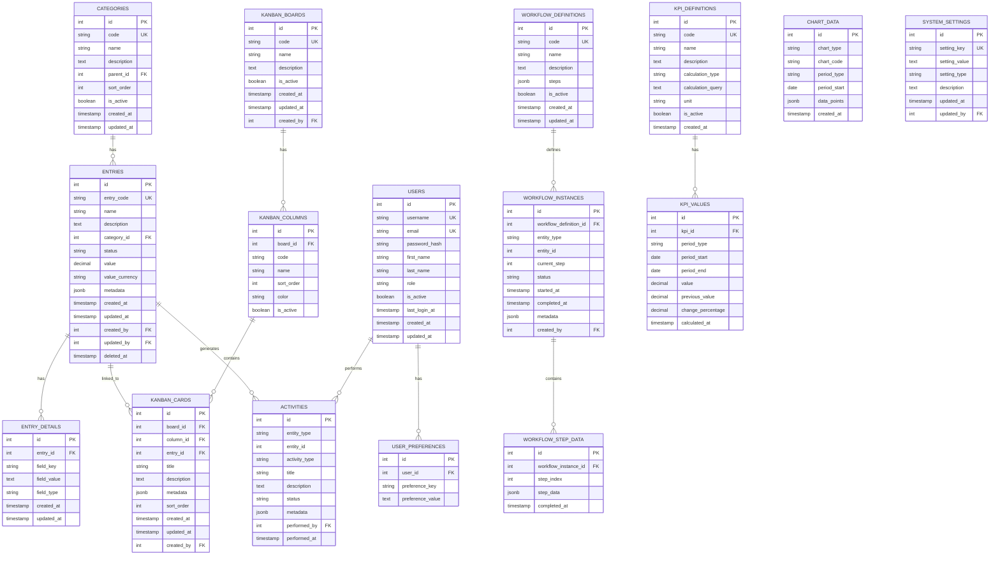

# Entity Relationship Diagram (Visual)

## Complete Database Schema Diagram

## Key Relationships Explained

1. **Categories → Entries**: One category can have many entries (optional relationship)
2. **Entries → Entry Details**: Flexible attribute storage for entries
3. **Entries → Activities**: Complete audit trail for all entry changes
4. **Workflow Definitions → Instances → Step Data**: Workflow execution tracking
5. **Kanban Boards → Columns → Cards**: Hierarchical kanban structure
6. **KPI Definitions → KPI Values**: Time-series metric storage
7. **Users → Activities**: Track who performed what actions
8. **Users → Preferences**: User-specific settings storage

## Data Cardinality

- **1:Many** relationships are the primary pattern
- **Optional** relationships allow for flexible data models
- **Soft deletes** on entries preserve referential integrity
- **JSONB fields** provide extensibility without schema changes
